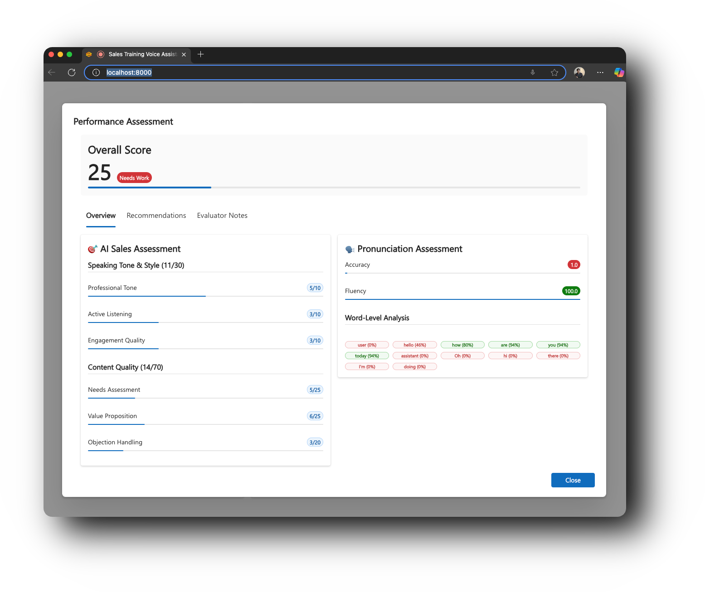
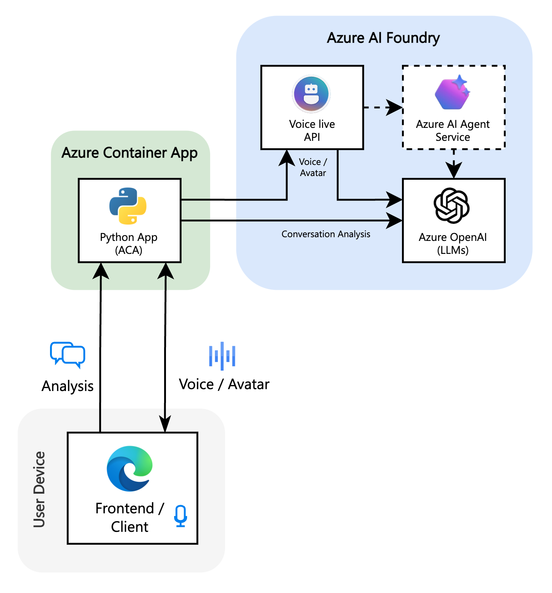

<p align="center">
  <h1 align="center">VoiceLab Sales Trainer</h1>
</p>
<p align="center">AI-powered voice training for sales professionals, built on Azure.</p>
<p align="center">
  <a href="https://github.com/Azure-Samples/voicelive-api-salescoach"></a>
  <a href="https://github.com/Azure-Samples/voicelive-api-salescoach/blob/main/LICENSE"></a>
  <a href="https://azure.microsoft.com"></a>
</p>


---

## Overview

VoiceLab Sales Trainer is a demo application showcasing how AI-based training could be used in sales education using Azure AI services. Practice real-world sales scenarios with AI-powered virtual customers, receive instant feedback on your performance, and improve your sales skills through immersive voice conversations.

### Features

- **Real-time Voice Conversations** - Practice sales calls with AI agents that respond naturally using Azure Voice Live API
- **Performance Analysis** - Get detailed feedback on your conversation skills
- **Pronunciation Assessment** - Improve your speaking clarity and confidence with Azure Speech Services
- **Scoring System** - Track your progress with metrics



### Tech Stack

- **Azure AI Foundry** - Agent orchestration and management
- **Azure OpenAI** - GPT-4o for LLM responses and performance analysis 
- **Azure Voice Live API** - Real-time speech-to-speech conversations with AI agents
- **Azure Speech Services** - Post-conversation fluency and pronunciation analysis
- **React + Fluent UI** - Modern, accessible user interface
- **Python Flask** - Backend API and WebSocket handling

## Getting Started 

### Prerequisites

- **Docker**: Install [Docker](https://www.docker.com/get-started) to run the application in a containerized environment.
- **Node.js**: Install [Node.js](https://nodejs.org/) for the frontend development.
- **Python**: Install [Python](https://www.python.org/downloads/) for the backend development.

### Option 1: Docker (Recommended)

1. **Clone the repository**
   ```bash
   git clone https://github.com/Azure-Samples/voicelive-api-salescoach.git
   cd voicelive-api-salescoach
   ```

2. **Set up environment variables**
   ```bash
   cp .env.example .env
   # Edit .env with your Azure credentials
   ```

3. **Run with Docker Compose**
   ```bash
   docker-compose up --build
   ```

4. **Or run with Docker directly**
   ```bash
   docker build -t voicelive-api-salescoach .
   docker run -p 8000:8000 --env-file .env voicelive-api-salescoach
   ```

Visit `http://localhost:8000` to start training!

### Option 2: Local Development

1. **Clone the repository**
   ```bash
   git clone https://github.com/Azure-Samples/voicelive-api-salescoach.git
   cd voicelive-api-salescoach
   ```

2. **Set up environment variables**
   ```bash
   cp .env.example .env
   # Edit .env with your Azure credentials
   ```

3. **Install dependencies**
   ```bash
   # Python dependencies
   pip install -r requirements.txt
   
   # Frontend dependencies
   npm install --legacy-peer-deps
   ```

4. **Build the frontend**
   ```bash
   npm run build
   ```

5. **Start the application**
   ```bash
   python app.py
   ```

Visit `http://localhost:8000` to start training!

## Quick Start with Azure Developer CLI

1. **Initialize Azure Developer CLI**:
   ```bash
   azd init
   ```

2. **Deploy to Azure**:
   ```bash
   azd up
   ```
3. **Access your application**:
   The deployment will output the URL where your application is running.


## Development

### Code Quality & Linting

This project uses linting tools to maintain code quality:

- **Python**: flake8 and black for linting and formatting
- **TypeScript**: ESLint and Prettier for linting and formatting

#### Available Scripts

```bash
# Run linters
npm run lint

# Format code
npm run format

# Run tests
npm run test
```

#### Manual Linting

```bash
# Python linting
flake8 . --config=.flake8
black . --config pyproject.toml

# TypeScript linting
npx eslint . --ext .ts,.tsx
npx prettier --write "src/**/*.{ts,tsx,js,jsx,json,css,md}"
```

## Demo 

1. **Choose a Scenario** - Select from various sales situations (cold calling, objection handling, etc.)
2. **Start the Conversation** - Click the microphone and begin your sales pitch
3. **Engage with AI** - The virtual customer responds realistically based on the scenario
4. **Receive Feedback** - Get instant analysis on your performance including:
   - Speaking tone and style
   - Content quality
   - Needs assessment
   - Value proposition delivery
   - Objection handling skills

## Architecture

The following diagram shows the high-level architecture of VoiceLab Sales Trainer and how it integrates with various Azure AI services:



## Contributing

This is a demo application showcasing Azure AI capabilities. Feel free to fork and experiment!

## License

MIT License - See [LICENSE.md](LICENSE.md) file for details
